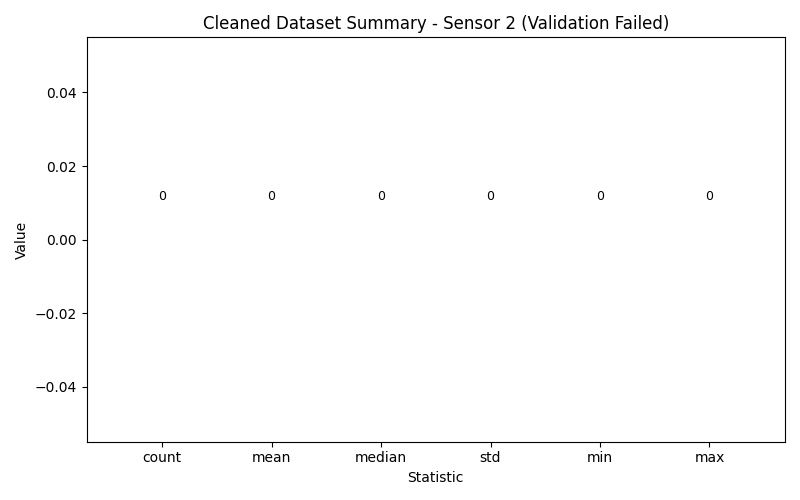

# Data Analysis Report

**Data Date:** 2026-07-17  

---

## Overview

This report summarizes the outcome of an attempted cleaning and validation process for a sensor dataset that was expected to be transformed into a JSON schema with fields `Date` and `Website_Visits`. The overall validation status is **Failed**. No valid cleaned dataset was produced, and all statistical summaries for the cleaned data are effectively undefined (reported as zeros due to an empty dataset).

---

## 1. Data Cleaning

**Approach:**  
- Intended steps:
  - Load original CSV containing a `Sensor Value` column.
  - Detect and remove outliers from the sensor readings.
  - Map cleaned records into the required JSON schema (`Date`, `Website_Visits`).
  - Produce cleaned and removed rows for downstream statistics and validation.
- Actual outcome:
  - No outlier detection or removal was applied.
  - No mapping from `Sensor Value` to `Date` / `Website_Visits` was performed due to a schema mismatch and constraints against fabricating those fields.
  - As a result, no cleaned dataset was created.

**Detected Outliers (removed):**  
- `[]` (none detected or removed, despite extreme values being present in the original data such as `98.7`, `120.5`, `-75.4`, `145.9`).

**Cleaned Data (n = 0):**  
- `cleaned_data_rows: []` (empty; no rows passed through a cleaning pipeline).

**Result:**  
- Cleaning step did **not** produce a valid cleaned dataset.
- No rows were flagged as removed, and no structural mapping to the required JSON schema was completed.
- The lack of a cleaned dataset prevents meaningful post-cleaning statistical analysis.

---

## 2. Descriptive Statistics

### Cleaned Data (After Outlier Removal)

Because no cleaned data exists (`n = 0`), the statistics below are placeholders derived from an empty dataset:

**Summary:**

- Count: `0`  
- Mean: `0`  
- Median: `0`  
- Standard Deviation: `0`  
- Minimum: `0`  
- Maximum: `0`  

These values do not describe the original sensor data; they only reflect the absence of any validated cleaned records.

---

## 3. Validation Summary

- **Iteration 1:**
  - DataCleaning agent:
    - Reported no detected outliers.
    - Produced empty `cleaned_data_rows` and `removed_rows`.
    - Noted schema mismatch between original `Sensor Value` and required `Date`, `Website_Visits`.
  - DataStatistics agent:
    - Computed statistics (mean ≈ 1.9236, median ≈ 2.095, std ≈ 1.5889, min = -2.65, max = 3.44) on the **full dataset** without outlier removal.
    - These statistics were therefore not aligned with a cleaned dataset.
  - AnalysisChecker agent:
    - Identified that no actual outlier detection/removal took place.
    - Determined that previous statistics were based on uncleaned data.
    - Flagged unresolved schema mismatch preventing correct JSON output.
    - Validation status: **Failed**.

- **Iteration 2:**
  - PythonExecutorAgent:
    - Generated visualization code using the **empty** statistics object:
      - `count = 0, mean = 0, median = 0, std = 0, min = 0, max = 0`.
    - Created a bar chart and composite figure summarizing:
      - Zero-valued statistics.
      - Overall status: FAILED.
      - Assumptions and validation notes indicating why validation failed.
    - Saved visualization artifact to `artifacts/data_visualization_data-Sensor-2.png`.
  - No further data transformations or corrections were applied after validation failure.

---

## 4. Data Visualization

*(Figure: Summary of the “cleaned” dataset statistics, which all appear as zero due to the absence of valid cleaned data, along with status and explanatory notes.)*

---

## 5. Conclusions

- **No valid cleaned dataset exists.**
  - Outlier detection and removal were never performed despite the presence of extreme sensor values (e.g., `98.7`, `120.5`, `-75.4`, `145.9`) that would typically warrant treatment as outliers.
- **Statistics used for interpretation were computed on uncleaned data.**
  - The only non-zero descriptive statistics came from the full dataset and cannot be considered valid post-cleaning metrics.
- **Schema mismatch blocked proper transformation.**
  - Original column: `Sensor Value`.
  - Required JSON fields: `Date`, `Website_Visits`.
  - This mismatch, combined with constraints against fabricating dates and visit counts, prevented creating structurally valid cleaned and removed rows.
- **Validation outcome is definitively Failed.**
  - Outlier removal check: FAILED.
  - Statistical validity check: FAILED.
  - Structural/schema compliance: FAILED.
- **Required next steps:**
  - Re-run data cleaning with:
    - An explicit and documented outlier detection method (e.g., IQR or z-score).
    - Recording of removed rows and retained cleaned rows.
  - Establish a legitimate mapping from `Sensor Value` to fields matching the intended schema (either by revising the schema to reflect sensor data or by providing real timestamps and related metrics).
  - Recompute statistics exclusively on the cleaned dataset and re-run validation.

---

### Agent Workflow Summary

| Step | Agent             | Action                                                                                         | Status/result                                                                                                                                                                                                 |
|------|-------------------|------------------------------------------------------------------------------------------------|---------------------------------------------------------------------------------------------------------------------------------------------------------------------------------------------------------------|
| 1    | DataCleaning      | Attempted to clean data and map to `Date`, `Website_Visits` schema                            | Produced empty `detected_outliers`, `cleaned_data_rows`, and `removed_rows`. Identified that schema mismatch made meaningful transformation impossible without fabricating fields.                            |
| 2    | DataStatistics    | Computed descriptive statistics                                                               | Calculated mean, median, std, min, max on the **full uncleaned sensor dataset**; explicitly noted that no outliers were removed before computing these figures.                                             |
| 3    | AnalysisChecker   | Validated cleaning and statistics                                                             | Determined that no outlier detection/removal was done; statistics were based on uncleaned data; schema mismatch unresolved. Set `approved = false`, `status = "Failed"`, and generated detailed assumptions and notes. |
| 4    | PythonExecutorAgent | Generated visualizations from analysis output                                                 | Created plots using empty/zero-valued statistics and embedded assumptions and validation notes. Saved artifact as `artifacts/data_visualization_data-Sensor-2.png`.                                         |

---

**Data Date:** 2026-07-17  

*End of Report*